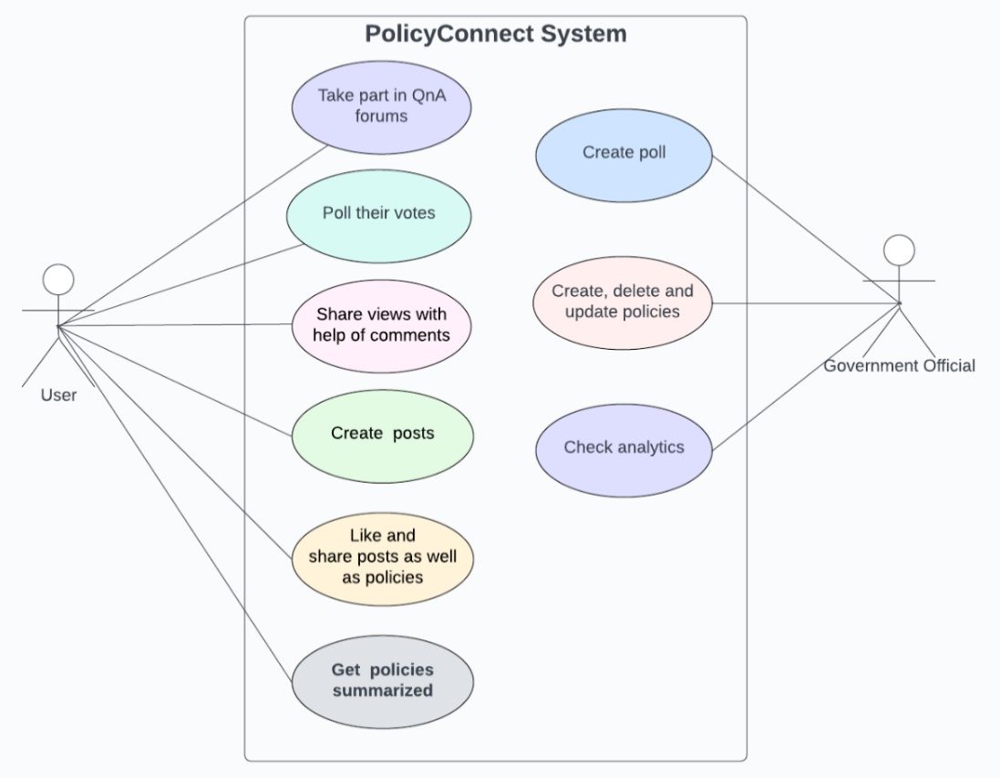

# PolicyConnect

**Enhancing Transparency in Government Policies**

## Project Overview
PolicyConnect aims to revolutionize citizen engagement in the democratic process by creating a user-friendly platform for discussing, questioning, and understanding government policies. This social media-like platform encourages active participation, transparency, and collaboration between citizens and government officials. With features like Q&A forums, polls, and AI-driven tools for policy summarization (Simplifying legal language), PolicyConnect empowers citizens to make informed decisions and contribute to a just and equitable society.

## Features
- **Q&A Forums:** Provides users with a dedicated space to raise issues, ask questions, and engage in discussions related to government policies.
- **Polls:** Enables government officials to gather feedback from users on specific policy-related questions or decisions.
- **Comment Section:** Allows citizens to share their views, opinions, and feedback on government policies in a conversational format.
- **Policy Summaries:** Utilizes AI tools to provide concise policy summaries and simplify complex language to enhance user understanding.
- **User Posts:** Facilitates user engagement by allowing individuals to create and share content related to government policies.
- **Analytics Dashboard:** Provides government officials with data-driven insights into user engagement on the platform, enabling informed decision-making and policy assessment.

## Technical Implementation
### Backend (Node.js & Express.js)
- **Server Setup:** Utilizes Node.js with Express.js for handling backend operations.
- **Database (MongoDB):** Implements MongoDB for storing user data, posts, poll information, and other relevant data.
- **Authentication:** Integrates user authentication using JWT for secure access to user-specific features.

### Frontend (React.js)
- **User Interface:** Develops a responsive and dynamic user interface using React.js for seamless user interactions.
- **State Management:** Implements state management using Redux for maintaining a centralized and consistent state across the application.
- **Real-Time Updates:** Integrates WebSocket or a real-time communication library for providing instant updates to users.

### AI Integration (ChatGPT Api)
- **Integrations:** Incorporates ChatGPT's API for AI-driven features such as policy summarization and language simplification.
- **Caching and Optimization:** Implements a caching mechanism to store previously generated summaries and optimize API calls.

### Gamification and Analytics
- **Gamification Elements:** Introduces gamification elements into the frontend to incentivize user engagement.
- **Analytics Integration:** Incorporates analytics tools to monitor user engagement and track key metrics.

## Impact and Benefits
- **Enhanced Citizen Engagement:** Fosters active participation in policy discussions, creating an informed and engaged citizenry.
- **Transparent Government:** Promotes transparency by allowing citizens to question policies and receive timely responses.
- **Feedback Mechanism:** Provides a structured platform for government officials to gather valuable feedback through polls and discussions.




To start the backend and frontend of PolicyConnect, follow these steps:

### Backend (Node.js & Express.js):

1. Navigate to the `startup-backend` directory in your terminal:
   ```bash
   cd startup-backend
   ```

2. Install the required dependencies:
   ```bash
   npm install
   ```

3. Start the backend server:
   ```bash
   npm start
   ```

4. The backend server should now be running, and you should see output indicating that the server is listening on a specific port (e.g., `Listening on port 3000`).

### Frontend (React.js):

1. Navigate to the `startup-frontend` directory in your terminal:
   ```bash
   cd startup-frontend
   ```

2. Install the required dependencies:
   ```bash
   npm install
   ```

3. Compiles and hot-reloads for development:
   ```bash
   npm run serve
   ```

4. Access the frontend application by opening a web browser and navigating to the URL provided in the terminal (usually `http://localhost:8080/`).

5. You should now be able to interact with the PolicyConnect frontend application in your web browser.

## Conclusion
PolicyConnect is not just a platform; it is an effort towards a more participatory and informed democracy. We are confident that our innovative approach will revolutionize citizen engagement and contribute to building a just and equitable society. We look forward to the opportunity to bring PolicyConnect to life and make a lasting impact on transparent governance.

## Team
- **Rohit Shinde** (github.com/rohitshinde333)
- **Harishri Vaidya** (github.com/Harishrirajendra)

## Institution
- Indian Institute of Technology, Madras
- Walchand College of Engineering, Sangli


## Acknowledgements
We would like to express our gratitude to Hack4Change, IIT Madras for opportunity.

